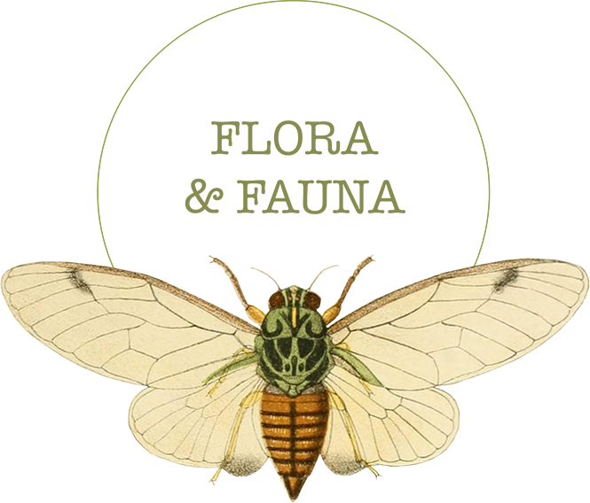

# 

# Flora and Fauna Memory Game

<a href="https://evabroberg.github.io/Flora-and-Fauna-memory-game/" target="blank">Check out the game</a> 
	<a href="https://github.com/EvaBroberg/Flora-and-Fauna-memory-game" target="blank">Check out the code</a>
 

# Project Goals

Flora and Fauna is a memory game with a goal to entertain and visually appeal to the player, game is targeted for anybody who wants a fun way to spend short period of free time, suitable for children but designed for a grown up user.

<b>Players goals:</b>

<ul>
	<li>Fun way to spend time</li>
	<li>Easy to understand and use</li>
	<li>Designed to match a theme there fore visually appealing</li>
</ul>

<h2>UX</h2>

<b>Why Flora and Fauna is awesome</b>

<ul>
	<li>Whole design was thought of and exsecuten on adobe photoshop before programming</li>
	<li>Design is responsive allowing user to play on any device</li>
	<li>Users name is displayed on the screen during game</li>
	<li>Colour scheme, sounds and imagery was carefully selected to fit overall game theme</li>
	<li>Colour scheme was chosen to be neutral and calming, easy to look at and not provocative, stress inducing</li>
</ul>

The game was created for people of any age that are looking for a fun way to spend a bit of free time and are looking for a game that would not only be entertaining but would also stimulate the brain. While game is kid friendly and easy to understand and navigate, it's primaraly purpose was to appeal for a grown-up who needs to add some fun into their busy scedule.

Game was designed to be responsive, intuitive and easy to use on any devices. Sounds were added to card flips to make it obvious when the match is made or card combination was wrong. Background sound was added in order to make game environment more engaging and stimulating, but the player that prefers soundless game can easily disable sound by clicking a speaker button which is displayed in the obvious place at the top of the screen and is easily recognisable as a tool for sound control.

Game consists of three levels which are increasing in coplexity by adding extra cards. Each level has flora and fauna theme separated by cathegory: 1st level is Sea-creatures sub-cathegory, 2nd level bugs/insects and third plants/flowers. Cathegories were split rather than mixed to increase player's interest in game, when looking forward what awaits on the next level.

Once level is passed, pop up identifying the beginning of next level appears making it easy to follow progress in the game. If player has run out of given time or used up given amount of turns game over screen appears, a big and obvious button with text "Try Again" is displayed encorouging a player to start over. Once the game is won victory music is being played and "Congratulations" overlay fills the screen. Big button with words "Play again" appears similarly like in the "game over" state.

<h2>User stories</h2>

<ul>
	<li>As a person with a long commute to work I want something fun and engaing to make time go faster, I however prefer someting that is eye appealing and design not for children, so I don't feel embarassed if somebody on the bus is looking at my screen</li>
	<li>As a student I sometimes need to take a break from books and do something studies-unrelated to get my mind off things and give myself a break. A short game does it, I do enjoy a brain stimulating games though, in order to beat the guilt of wasting time</li>
	<li>As a person who doesn't like wasting time, I need an activity while I'm in the waiting rooms for appointments or in the que in the shop, a game that is easy enough yet with a little challenge makes time go faster</li>
</ul>

<h2>Raugh wireframe mockups</h2>

<ul>
	<li><a href="wireframes/login.jpg" target="_blank">Log-in page</a></li>
	<li><a href="wireframes/1.jpg" target="_blank">First Level</a></li>
	<li><a href="wireframes/2.jpg" target="_blank">Second Level</a></li>
	<li><a href="wireframes/3.jpg" target="_blank">Third Level</a></li>
	<li><a href="wireframes/rules.jpg" target="_blank">Lost Page</a></li>
	<li><a href="wireframes/win.jpg" target="_blank">Win Page</a></li>
</ul>

<h2>Final Wireframe mockups</h2>

<ul>
	<li><a href="wireframes/Complete design/login.jpg" target="_blank">Log-in page</a></li>
	<li><a href="wireframes/Complete design/1.jpg" target="_blank">First Level</a></li>
	<li><a href="wireframes/Complete design/2.jpg" target="_blank">Second Level</a></li>
	<li><a href="wireframes/Complete design/3.jpg" target="_blank">Third Level</a></li>
	<li><a href="wireframes/Complete design/back.jpg" target="_blank">Closed card board</a></li>
	<li><a href="wireframes/Complete design/nextLevel.jpg" target="_blank">Next Level</a></li>
	<li><a href="wireframes/Complete design/lost.jpg" target="_blank">Losing</a></li>
	<li><a href="wireframes/Complete design/win.jpg" target="_blank">Winning</a></li>
</ul>

<h2>Features</h2>

Game environment is fully responsive allowing user to play on any devices, desktop version fits all the visual information on the screen without scrolling allowing user to see and engage with all the game features. For mobile view 1st level cards are displayed in pairs rather than in threes in attempt to keep card size larger and avoid unecessary white space at the bottom of the screen, as the number of cards increases cards get smaller attemting to allow as many rows as needed to try ank keep all the cards visable without scrolling.

i- icon for game instructions and speaker icon is added to the Log in page allowing user to familiarise with a game and decided whether they want sound effects or not before game starts.

All levels of the game share same design theme (same headder displaying logo in the middle timer on the top left corner, flip count on the top right corner and a good luck message including their chosen name under the header). The only thing changing as the game progresses is the amount of cards displayed and the theme of the cards whick is divided in three categories. Log in page was created to go with an overall design using overlay of the same colour as dominant colour of the game background, same fonts and logo are also displayed. All the overlay displays such as: "You won", "game over", "next level" share exact same style and identical buttons to provide consistancy.

<h2>Log-in Page</h2>

Log in page is imediately displayed once user access game, it overlays all the content displaying large logo and requiring an input of the chosen name. If name hasn't been entered modal pops up alerting that name must be provided. at the top right corner of log-in page (top middle for mobile devices) user can navigate to "i" or "speaker" icons and read game rules as well as to disable sound effects. Once user has familiarised themselves with game rules, amended sound options and chosen a name they then press the button to start the game (it is also possible to access the game by pressing enter, in order to provide convenience).

<h2>First Level</h2>

As soon as user enters the game "Good luck 'User's chosen name" is displayed on the screen and timer starts a count down from 60 and a game background music starts playing (unless user had previously disabled it). Player flips first card (every flip of the card has a sound effect), player flips a second card, on the top right flip count increases by 1. If the match is made user hears a match sound and cards stay face up, if cards didn't match no-match sound activated and cards flip back. Users get to try until they either ran out of given time or exceeded a given amount of flips per game. If the game was lost, losing sound activates and overlay anouncing lost game appears covering all content. Under thext "Sorry, you have lost" a big button with text "Try again" is displayed allowing user to reset the game. Every time user starts a new game cards are reshuffled and their position changes. If player has matched all the cards in time given and not exceeded number of flips provided overlay next level appears. It's functionality works similarly to game over overlay as it displays text and the button, the only difference being that the button will lead to a second level rather than restarting the game.

<h2>Second Level</h2>

Once user had clicked "Start next level button" all same features as level one are activated, background music, timer and flip count starts working. More cards are added to the board and the rest of the game is identical to the first level.

<h2>Third Level</h2>

Exactly same as 1st and 2nd levels except even more cards are added to the board and if all cards were matched this time the game is won. "Congratulations You Won" overlay appears and victory sound is played. This overlay has same functionality as game over displaying text and a button to "Play again", only the messaging changes.

<h2>Existing features</h2>

<ul>
	<li>Log in page conists of form and a submmit button allowing player to choose the name before game starts, which is later displayed on the screen</li>
	<li>information and sound icons are provided that grows and changes colour when hovered over, allowing user to amend sound affects and read game rules before game starts </li>
	<li>Timer and flip count is provided throughout all levels of the game, sharing style and functionality</li>
	<li>Users name with "good luck message" is displayed throughout all levels of the game</li>
	<li>Set of interactive cards that shares same style properties (increasing in number by level) is provided throughout the game</li>
	<li>"Next Level", "Game over" and "You won" overlays are activated on each level also consisting of the button encouraging user to restart a game or progress to the next level</li>
	<li>Same footer is used throughout the game indicating copy right with a year of game creation and an github icon which grows and changes colour when hovered over and on the click leads a user to a github repository where they are able to check out the code behind the game</li>
</ul>

<h4>Features to improve or create</h4>

<ul>
	<li>Create a registration form so that user can log in and continue their game where they left off (need to advance in JS)</li>
	<li>Amend that once user restarts the game they don't have to log in again, their name continues being displayed on the screen(need to advance in JS)</li>
	<li>Add more levels</li>
	<li>Add grading system, that remembers users best score at shortest time and least amount of flips there fore it can track personal record and announce when results were improved (need to advance in JS)</li>
	<li>Add a CSS animation for when game is won (need to advance in CSS)</li>
</ul>

<h4>Technologies used</h4>

<ul>
	<li>Adobe Photoshop was used to create frameworks, cards, logos and icons</li>
	<li>Game was built using HTML, CSS, vanilla JavaScript and JQueries</li>
	<li>Code editor Visual Studio Code was used as a development environment</li>
	<li>Google Fonts were used with text styling purposes</li>
</ul>

<h2>Testing</h2>

Testing information can be found in separate <a href="testing.md">testing.md file</a>

<h2>Deployment</h2>

This project was developed using the Visual Studio Code IDE, committed to git and pushed to GitHub using Git open source version control system which I have installed to my computer.

Take the following actions in order to view a deployed version of the page:

<ol>
	<li>Log in to GitHub.</li>
	<li>Select <b>EvaBroberg/Flora and Fauna</b> from the list of repositories.</li>
	<li>Select <b>Settings</b> from the navbar near the top of the page.</li>
	<li>Scroll down to the GitHub Pages section.</li>
	<li>Under Source click the drop-down menu labeled None and select Master Branch. The page is automatically refreshed and the website is deployed.</li>
</ol>

Take following actions in order to run this project locally:

<ol>
	<li>Follow this link to the <a href="https://github.com/EvaBroberg/Flora-and-Fauna-memory-game">GitHub repository</a></li>
	<li>Under the repository name, click a green button that says "Clone or download"</li>
	<li>Copy the clone URL (make sure you have selected clone with HTTP section)</li>
	<li>In your local workspace open Git Bash</li>
	<li>Make sure you are inside of the directory where you want the cloned directory to be located.</li>
	<li>Type git clone and paste the URL copied from GitHub like so:

	<pre>git clone https://github.com/USERNAME/REPOSITORY</pre>
</li>
</ol>

<h2>Credits</h2>

<h4>Content</h4>

<ul>
	<li>Game was designed, built and executed by Ieva Broberg.</li>
</ul>

<h4>Media</h4>

<ul>
	<li>Images used for cards and logo were taken fron free source vintage botanical imagery collection at <a href="https://www.flickr.com/photos/biodivlibrary/albums/">Flickr</a></li>
	<li>Sounds for the game were taken from a free sound library</li>
</ul>

<h4>Code</h4>

<h2>In preparation for the game development these educational videos were watched: </h2>
<ul>
	<li></li>
	<li></li>
	<li></li>
	<li></li>
	<li></li>
</ul>

<h2>To get better understanging of JS these external resources were used</h2>
<ul>
	<li></li>
	<li></li>
	<li></li>
</ul>

<h2>Acknowledgements</h2>

<ul>
	<li>Codebar.io coders meet-up group for supporting me on my progress in JS and general advice</li>
	<li>FreeCodeCamp developers meet-up group for feedback on my work</li>
	<li>Mentors and fellow students on slack for help around the clock regarding any coding issue</li>
	<li>Super Thanks to Spencer Barriball for being available whenever I got stuck and needed advice.</li>
</ul>

<h2>Disclaimer</h2>

Game was created for educational purpouses only and is not available for profit. I do not hold copy rights of imagery or sound effects.
